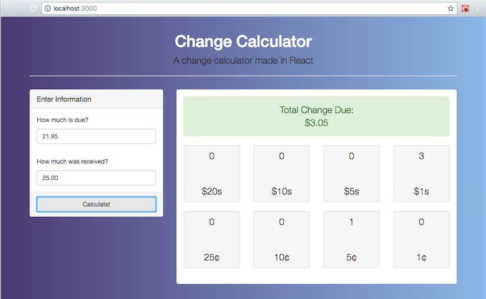
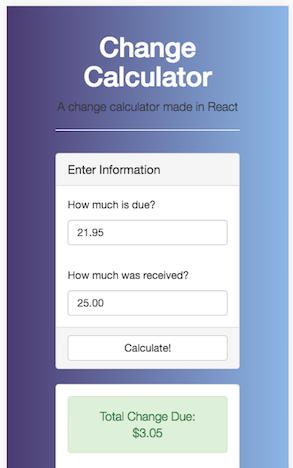

# React Change Calculator
> Calculates change due for each denomination contained in the state of the component and prints the number of denomations to the correct area of the application.

This was my ninth project at Origin Code Academy. This change calculator was made using React.




## Background

React is a JavaScript library for building user interfaces.

## Approach

I took a mobile-first approach with this app and created a responsive design contingent on the dimensions of the device screen.

## Installation

Download all associated files and load them up in your favorite text editor!

## Development setup

```
npm install
```
```
npm run build
```
```
npm start
```

## Contributing

* Please follow the AirBnB styleguide.

* Open a pull request, all contributions will be considered.

## Contact Information

Twitter: [@adriftinthesea](https://twitter.com/adriftinthesea)

Email: z@zamarise.com

GitHub: [https://github.com/zamarise](https://github.com/zamarise/)
